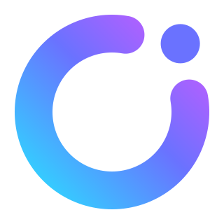
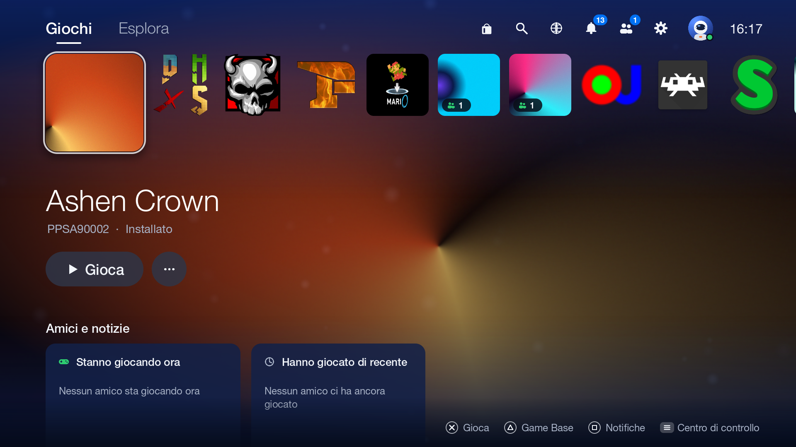
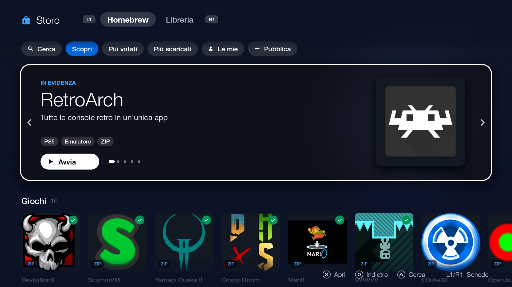
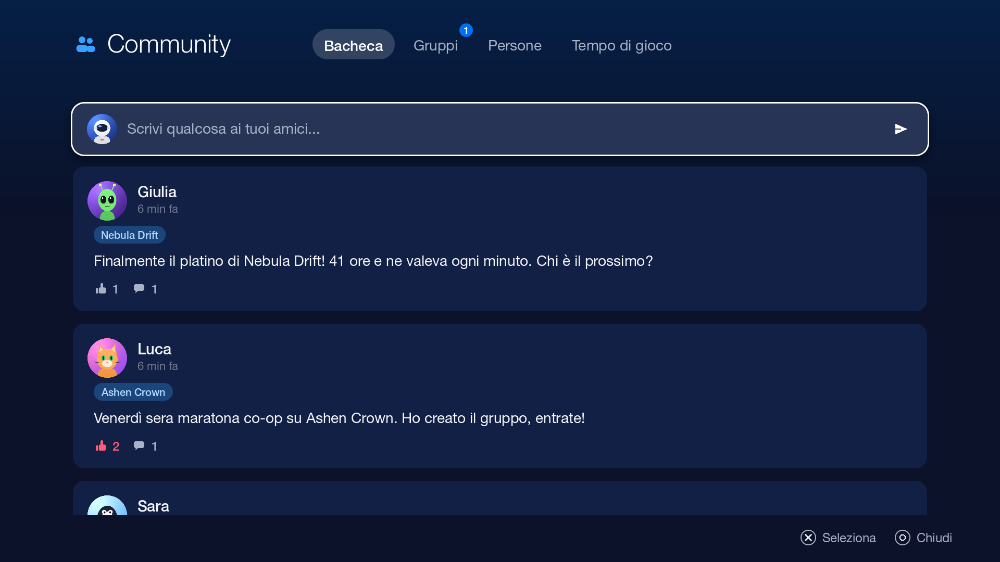
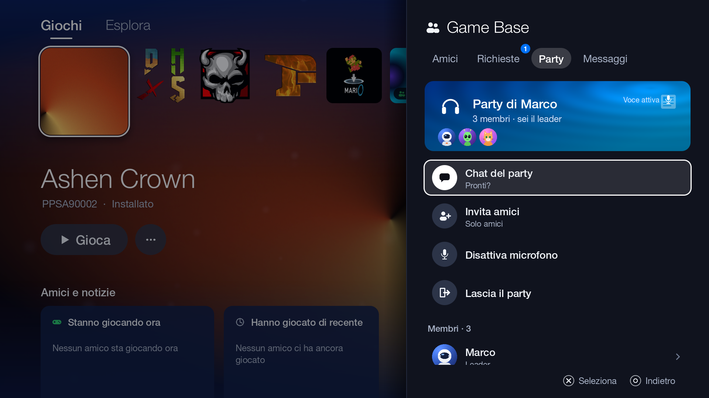
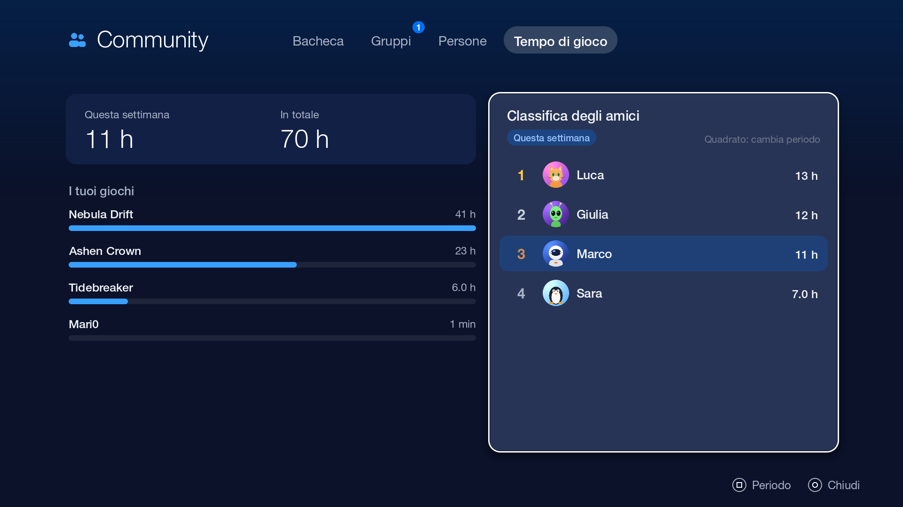
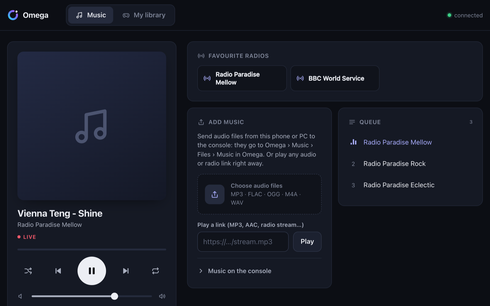
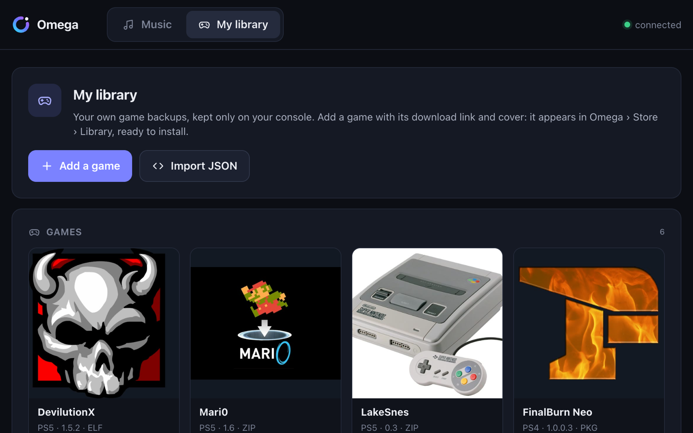

<p align="center">
  <picture><source media="(prefers-color-scheme: dark)" srcset="docs/img/omega-mark.svg"></picture>
</p>

<h1 align="center">Omega</h1>

<p align="center">
  Dashboard mã nguồn mở cho máy PS5 chạy được homebrew: trò chơi, Store, nhạc, bạn bè và party trong một nơi duy nhất.<br>
  Phát triển bởi <a href="https://outlinedigital.it"><b>TheCriicom</b></a>.
</p>

<p align="center"><sub><a href="README.md">English</a> · <a href="README.it.md">Italiano</a> · <a href="README.ja.md">日本語</a> · <a href="README.fr.md">Français</a> · <a href="README.es.md">Español</a> · <a href="README.de.md">Deutsch</a> · <a href="README.nl.md">Nederlands</a> · <a href="README.pt-PT.md">Português (Portugal)</a> · <a href="README.pt-BR.md">Português (Brasil)</a> · <a href="README.ru.md">Русский</a> · <a href="README.ko.md">한국어</a> · <a href="README.zh-Hans.md">简体中文</a> · <a href="README.zh-Hant.md">繁體中文</a> · <a href="README.fi.md">Suomi</a> · <a href="README.sv.md">Svenska</a> · <a href="README.da.md">Dansk</a> · <a href="README.nb.md">Norsk bokmål</a> · <a href="README.pl.md">Polski</a> · <a href="README.tr.md">Türkçe</a> · <a href="README.cs.md">Čeština</a> · <a href="README.hu.md">Magyar</a> · <a href="README.el.md">Ελληνικά</a> · <a href="README.ro.md">Română</a> · <a href="README.th.md">ไทย</a> · <b>Tiếng Việt</b> · <a href="README.id.md">Bahasa Indonesia</a> · <a href="README.uk.md">Українська</a></sub></p>

<p align="center">
  <a href="https://play.omegasuite.it">Trang web</a> ·
  <a href="https://play.omegasuite.it/installa">Cài đặt</a> ·
  <a href="server/README.md">Tự vận hành máy chủ</a> ·
  <a href="client/README.md">Phát triển</a>
</p>



Omega là một dashboard dành cho người dùng homebrew, và cũng là màn hình Home của
bạn nếu bạn muốn (ứng dụng sẽ hỏi ở lần chạy đầu tiên): trò chơi đã cài và
homebrew nằm chung một hàng, Store cài đặt chỉ với một nút bấm, nhạc vẫn phát
khi bạn chơi game, và bạn bè luôn ở ngay trong tầm tay. Omega chạy dưới dạng
homebrew (SDL2, kết xuất bằng phần mềm) và kết nối với một máy chủ mà ai cũng có
thể tự vận hành.

## Có gì bên trong

- **Home** gộp trò chơi và homebrew, hình nền động lấy từ artwork, khởi chạy
  trực tiếp (trò chơi qua LncUtil, homebrew qua websrv, payload ELF chạy nền).
- **Store** homebrew mã nguồn mở: tìm kiếm, kệ theo danh mục, bình chọn, đánh
  giá và bình luận. Tự nhận biết `.pkg`, `.zip` và `.elf` rồi cài từng tệp vào
  đúng chỗ.
- **Thư viện của tôi**: bản sao lưu các trò chơi bạn sở hữu, kèm liên kết tải về
  và ảnh bìa, thêm từ máy hoặc từ điện thoại, hoặc nhập từ một tệp JSON (nhập một
  lần, hoặc liên kết để luôn đồng bộ). Chỉ lưu trên máy.
- **Nhạc**, cả khi đang chơi game: radio internet (radio-browser), Navidrome và
  các máy chủ Subsonic khác, tệp trên USB, bất kỳ liên kết âm thanh nào. Việc phát
  nhạc chạy trong daemon nền (bản dựng FFmpeg chỉ có âm thanh), nên không bị dừng
  khi bạn mở một trò chơi.
- **Điều khiển từ điện thoại**: daemon phục vụ một trang web ở cổng 9095. Quét mã
  QR hiện trên máy, nhập PIN, rồi điều khiển nhạc, gửi tệp âm thanh và quản lý
  Thư viện của tôi từ trình duyệt của bất kỳ điện thoại, máy tính bảng hay PC nào.
- **Nhận diện HEN**: khi khởi động, Omega nhận ra OnionHEN, etaHEN, pldmgr hoặc
  ps5_autoloader, cho bạn biết còn thiếu gì và, sau khi bạn xác nhận, cài đặt và
  bật các dịch vụ của nó đúng chỗ. Trên OnionHEN, nó thêm một trang vào menu
  trong game (L2 + R3) với các nút điều khiển nhạc.
- **Công cụ hệ thống**: nhiệt độ, ngưỡng quạt, bộ nhớ và trình quản lý tệp.
- **Community**: tường với bài đăng, lượt thích và bình luận; trò chuyện nhóm;
  những người bạn có thể biết; thời gian chơi và bảng xếp hạng bạn bè.
- **Party** với trò chuyện bằng chữ và giọng nói (Opus), lời mời chơi game,
  trạng thái tùy chỉnh (trực tuyến, vắng mặt, không làm phiền, ẩn).
- **Game Base**: bạn bè, lời mời kết bạn và tin nhắn.
- **Quyền riêng tư**: chặn, báo cáo, ai có thể nhắn tin cho bạn, xuất dữ liệu,
  xóa tài khoản.
- **Chủ đề giao diện**, nhạc nền được tạo tự động, trình duyệt để đọc.
- **27 ngôn ngữ**: ứng dụng tự động theo ngôn ngữ của máy (và có thể đổi trong
  Cài đặt).
- **Tự chọn máy chủ**: thêm địa chỉ của bất kỳ máy chủ Omega nào trong Cài đặt;
  máy chủ chính thức luôn sẵn có.

| | |
|---|---|
|  |  |
|  |  |
|  |  |

## Cấu trúc kho mã

| Thư mục | |
|---|---|
| [`client/`](client) | ứng dụng cho máy (C, SDL2) và bản dựng desktop để phát triển trên Mac |
| [`daemon/`](daemon) | payload chạy nền: trình phát nhạc, trang web điều khiển từ điện thoại, Thư viện của tôi, thông báo trong lúc chơi và (chỉ khi bạn chọn) mở lại Omega khi bạn quay về Home |
| [`onionhen-plugin/`](onionhen-plugin) | plugin OnionHEN: một trang Omega trong menu trong game với các nút điều khiển nhạc |
| [`server/`](server) | API Node.js, proxy, bảng điều khiển kiểm duyệt và Docker Compose để vận hành máy chủ |
| [`docs/`](docs) | kiến trúc và hình ảnh |

## Cài đặt Omega lên máy

Bạn cần một máy PS5 đã jailbreak và hỗ trợ homebrew: một HEN như OnionHEN hoặc
etaHEN, hoặc một trình khởi chạy như [websrv](https://github.com/ps5-payload-dev/websrv)
cùng với một trình nạp payload.
Cách dễ nhất là mở [play.omegasuite.it/installa](https://play.omegasuite.it/installa)
bằng trình duyệt của máy. Hoặc bạn có thể tải gói từ trang web và sao chép
`data/` vào máy qua FTP.

## Tự vận hành máy chủ

```sh
git clone https://github.com/CristianLaporta/omega-dashboard-ps5.git
cd omega-dashboard-ps5/server
./scripts/install.sh
```

Script tạo tệp `.env` với các khóa bí mật ngẫu nhiên và khởi động các container.
Hướng dẫn đầy đủ, kèm HTTPS tự động qua Caddy, có trong
[`server/README.md`](server/README.md). Sau đó, trên máy:
**Cài đặt → Máy chủ → Thêm máy chủ**.

## Phát triển

- Ứng dụng: [`client/README.md`](client/README.md) — bản dựng cho PS5 bằng
  [ps5-payload-sdk](https://github.com/ps5-payload-dev/sdk) và bản dựng desktop
  dùng SDL2 từ Homebrew, điều khiển bằng tệp lệnh để thử giao diện mà không cần
  máy. Bản dịch nằm trong `client/i18n/` (mỗi ngôn ngữ một tệp JSON).
- Máy chủ: [`server/README.md`](server/README.md) — Node.js ≥ 20 và PostgreSQL,
  kiểm thử end-to-end bằng `npm test`.
- Kiến trúc: [`docs/architecture.md`](docs/architecture.md).

Mọi đóng góp đều được hoan nghênh: xem [CONTRIBUTING.md](CONTRIBUTING.md).

## Tác giả

Omega được phát triển bởi **TheCriicom** — [outlinedigital.it](https://outlinedigital.it).

## Giấy phép

Copyright © 2026 TheCriicom và những người đóng góp cho Omega.
Omega là phần mềm tự do: [GNU GPL v3 trở lên](LICENSE). Các thành phần của bên
thứ ba và giấy phép của chúng được liệt kê trong
[`client/THIRD-PARTY-NOTICES.md`](client/THIRD-PARTY-NOTICES.md).

Omega là một dự án độc lập, không liên kết với, không được chứng thực hay tài
trợ bởi Sony Interactive Entertainment. "PlayStation" và "PS5" là nhãn hiệu
thuộc chủ sở hữu tương ứng. Omega không chứa và không phân phối trò chơi.
